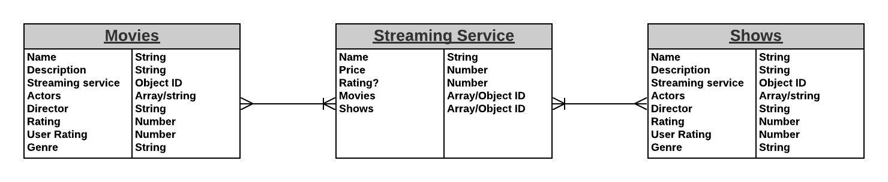

# Shelter and Chill
Unit Two Full Stack Project

## Index:

- [Overview](#Overview)
- [Link to Page](#Link-to-page)
- [ERD](#Entity-Relationship-Diagram)
- [Wireframes](#wireframes)
- [User Stories](#User-Stories)
- [Thanks](#Special-Thanks)

## Overview

Have you ever wanted to watch something but didn't know where to find it, what you actually wanted to watch, or what you can watch with the services you are already subscribed to? Well my friends you are in luck! **Shelter & Chill** was made to assist people who are just as lost as you!

## Link to page

https://www.shelterAndChill.com

## Technologies & Libraries Used

* Mongoose
* Express
* Node
* EJS 
* MongoDB
* CSS
* JavaScript
* Jquery
* Popper.js
* Bootstrap
* Cloudflare
* Google Fonts
* HTML

## Entity Relationship Diagram

## Wireframes

https://www.figma.com/proto/Xt6sAga0HibD1OUEppbyTp/Untitled?node-id=6%3A211&scaling=min-zoom

## User Stories

A user is defined as any individual who interacts with our website. 

The user will first be greeted by our landing page which displays the title of our website, as well as a carousel of popular titles and streaming services.

There will be a navigation bar the user can use to navigate the website. It will include a titles page, a services page, a create title page, and a create service page. 

If the user clicks the titles page, it will display (in descending order) a list of popular titles on our website. Users have the ability to either upvote or downvote a title based on their feedback. Each title will display the number of upvotes or downvotes it has received thus far, its director, its cast, a short synopsis, where it can be watched (streaming service). The number of upvotes or downvotes will determine its position on the titles page. 

If the user clicks the services page, it will also display in (descending order) a list of streaming services that users have added to the database. Each service will include information on name, price, and rating. When clicked on, it will display a list of titles that can be watched on that service. 

For the create page, a form will be available where the user can enter their own inputs for either a title or a streaming service. A user can delete and edit a title, but only edit the streaming service as we don’t want them to delete all titles associated with that service. 

## Planned Features

* Up vote and Down vote Feature
* Search Feature
* Login
* API call to http://www.omdbapi.com/ **Open movie Data Base**

## Special Thanks

* Jimmy
* Zach
* Adonis
* Yulia
* Michael
* Kenny
* Tony
* Melisa
* Allison & Dani
* Kevin Bacon

